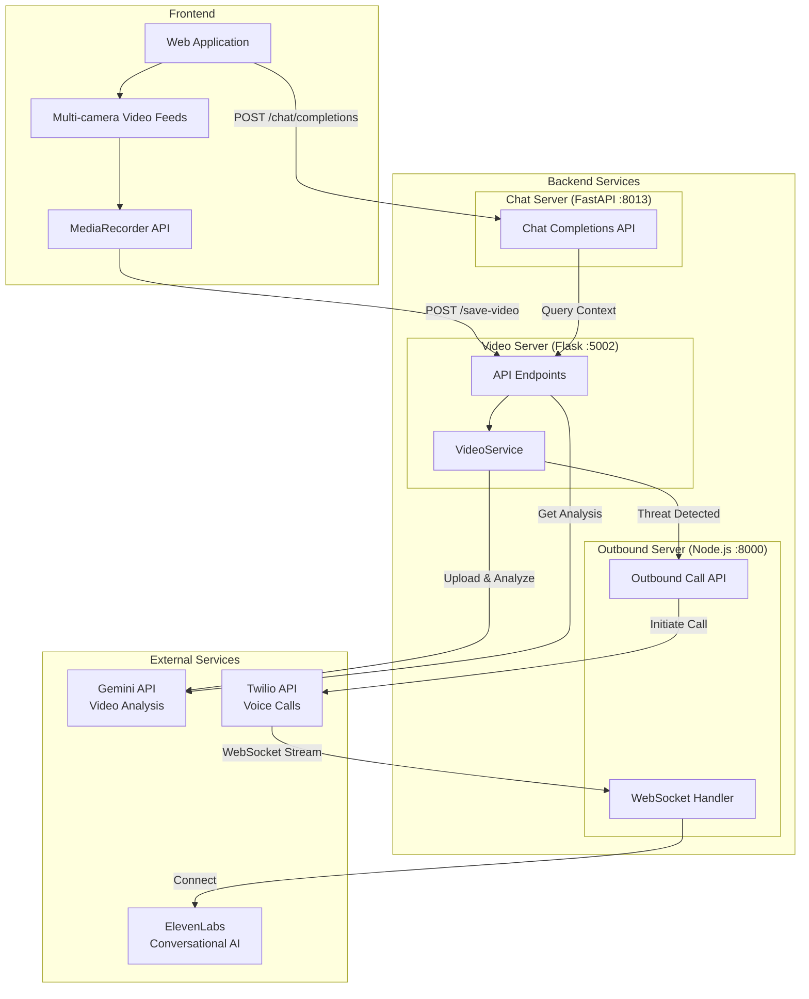
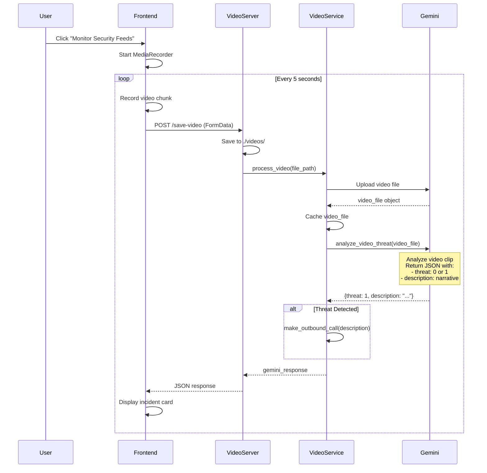
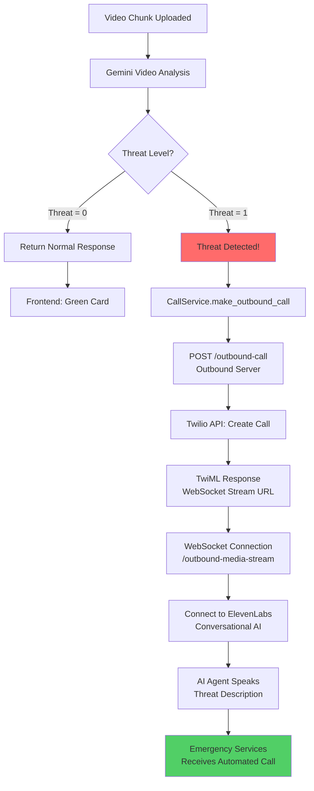
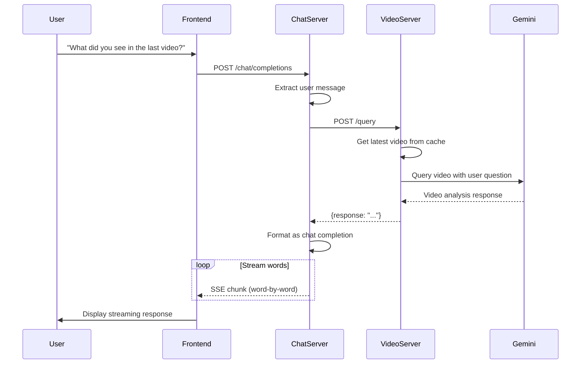
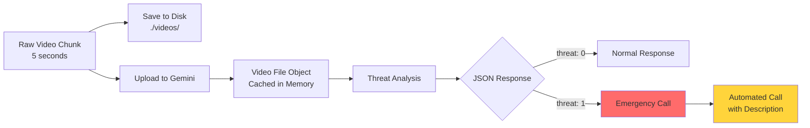

# ClampsAI

A real-time security monitoring system that uses AI to analyze video feeds and automatically alert emergency services when threats are detected.

## What It Does

ClampsAI continuously monitors video feeds from security cameras, analyzing each 5-second video chunk for potential threats. When a threat is detected (robbery, theft, violence, etc.), the system automatically places an emergency call to alert authorities with a detailed description of what was observed.

## How It Works

### System Architecture



### Video Monitoring & Threat Detection Flow



### Emergency Response System

When a threat is detected, the system automatically initiates an emergency call:



The AI agent speaks directly to emergency responders, providing a detailed description of the threat detected in the video.

### Chat Interface with Video Context

Users can query the system about what it has observed:



## Data Flow



## Key Components

### Backend Services
- **Video Server** (Flask): Receives video uploads, processes them with Gemini AI, and detects threats
- **Chat Server** (FastAPI): Handles natural language queries about video content
- **Outbound Server** (Node.js): Manages emergency calls via Twilio and ElevenLabs

### External AI Services
- **Google Gemini**: Analyzes video content and detects threats
- **ElevenLabs Conversational AI**: Voice agent that speaks to emergency responders
- **Twilio**: Handles the actual phone call infrastructure

### Frontend
- **Next.js Application** (`clamps/`): React-based web interface for monitoring feeds and viewing incidents
- Records 5-second video chunks continuously
- Displays threat detection results in real-time

## How to Use

1. **Start the backend services:**
   ```bash
   ./start.sh
   ```

2. **Start the frontend:**
   ```bash
   cd clamps
   npm install
   npm run dev
   ```
   Then open `http://localhost:3000` in your browser.

3. **The system will:**
   - Record 5-second video chunks from your camera
   - Analyze each chunk for threats
   - Display results in the interface
   - Automatically call emergency services if a threat is detected

## Configuration

All configuration is managed through environment variables (see `ENV_EXAMPLE.md`):
- API keys for Gemini, Twilio, and ElevenLabs
- Server ports and directories
- Model selection
